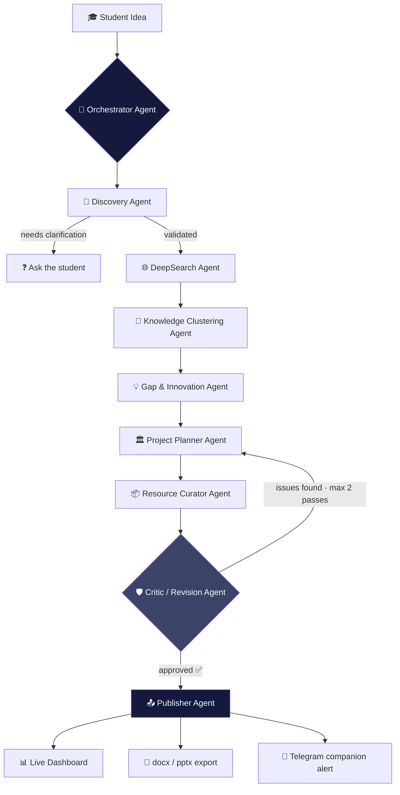
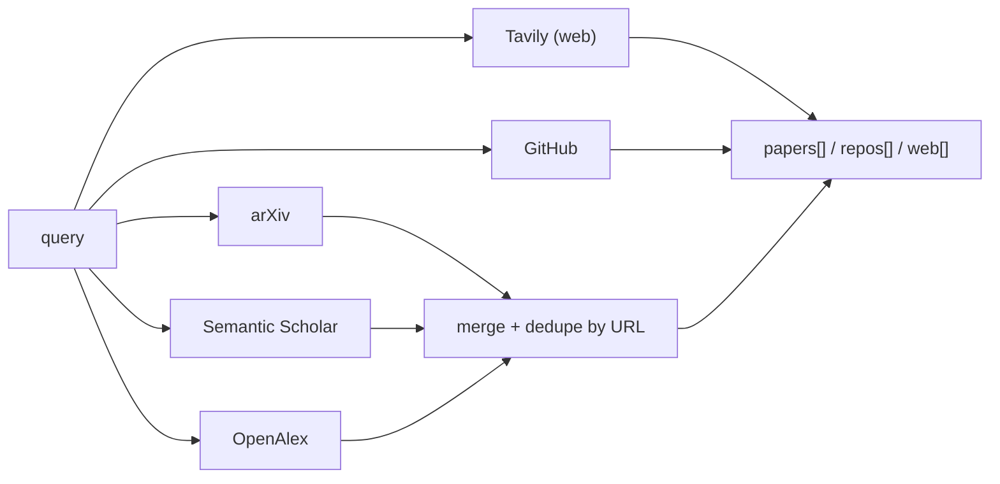

# ⚡ ResearchOS

### The multi-agent system that turns a raw idea into a verified, implementation-ready project — before your coffee gets cold.

<p>
  
  
  
</p>

> **"Search Less. Solve More."** — ResearchOS doesn't guess. It researches, clusters, critiques, and *proves* its work before you ever see it.

---

## 🧬 What is this

ResearchOS is a scalable, multi-agent research and innovation platform. You give it a raw idea. Nine specialized agents — coordinated by a central orchestrator — go find real papers, real repos, and real web sources, argue with each other about what's actually novel, fact-check every claim against the sources they found, and hand you back an architecture, a roadmap, and an exportable project plan.

No single-pass LLM guess. No invented citations. If the evidence isn't there, the system says so instead of making something up.

---

## 🏗️ Architecture



**DeepSearch fans out in parallel**, not sequentially:



---

## 🚫 The Zero-Hallucination Policy

This isn't a slogan — it's enforced in code, not just prompted for:

| Guardrail | Where it lives |
|---|---|
| Every agent's system prompt explicitly forbids inventing sources | All agent prompts |
| Gap & Innovation Agent must cite real `evidence_ids` for every claim | `gapInnovationAgent.js` |
| **Mechanical post-hoc verification** — any cited `evidence_id` that doesn't exist in the real retrieved source list gets stripped automatically, with a console warning | `stripUnverifiedEvidence()` |
| If retrieved evidence is too thin to responsibly claim a gap, the agent says `insufficient_evidence: true` instead of filling space | `gapInnovationAgent.js` |
| Critic Agent re-checks the *entire* assembled plan against original sources before publishing, capped at 2 revision passes | `criticAgent.js` *(upcoming)* |
| Test fixtures never contain fabricated data — sources that can't be reached live are left as honest empty arrays, never mocked | `fixtures/` |

---

## 🧠 The Agent Roster

| # | Agent | Job | Depends on |
|---|---|---|---|
| 1 | **Discovery Agent** | Validates the idea is specific enough to research; asks one clarifying question if not | — |
| 2 | **DeepSearch Agent** | Parallel retrieval across arXiv, Semantic Scholar, OpenAlex, Tavily, GitHub | Discovery |
| 3 | **Gap & Innovation Agent** | Finds genuine, source-grounded research gaps and innovation angles | DeepSearch |
| 4 | **Project Planner Agent** | Turns a chosen angle into architecture, stack, and milestones | Gap & Innovation |
| 5 | **Resource Curator Agent** | Attaches real datasets/repos/APIs — never invented URLs | Planner |
| 6 | **Knowledge Clustering Agent** | Embeds + clusters sources into themes | DeepSearch |
| 7 | **Critic / Revision Agent** | Verifies every claim against real sources, triggers a revision loop | Full draft |
| 8 | **Publisher Agent** | Renders dashboard JSON, docx, pptx, sends Telegram alert | Critic (approved) |
| 9 | **Orchestrator Agent** | Routes the whole pipeline, manages the revision loop, handles failures | All of the above |

### Build status (updated as we go — no agent is marked done until it's actually tested against real data)

- [x] **Discovery Agent** — built, syntax-verified. Live Gemini call not yet run (needs a real `GEMINI_API_KEY` + network outside the dev sandbox).
- [x] **DeepSearch Agent** — built and **live-tested**: GitHub search confirmed against real API results; arXiv XML parser confirmed against a real sample response. Semantic Scholar / OpenAlex / Tavily are syntax-verified, pending a live run on a machine with full internet access.
- [x] **Gap & Innovation Agent** — built. `stripUnverifiedEvidence()` guardrail **unit-tested and passing** (correctly strips a deliberately fabricated citation while keeping the real one). Full live run (real DeepSearch → real Gemini) pending your machine.
- [ ] Project Planner Agent
- [ ] Resource Curator Agent
- [ ] Knowledge Clustering Agent
- [ ] Critic / Revision Agent
- [ ] Publisher Agent
- [ ] Orchestrator (ADK) — built last, on purpose: every individual agent should be proven before the highest-hallucination-risk piece gets wired in

---

## 🛠️ Tech Stack

| Layer | Tool |
|---|---|
| LLM reasoning | Gemini 2.5 Flash (`@google/genai`) |
| Orchestration | Google ADK |
| Academic retrieval | arXiv API · Semantic Scholar API · OpenAlex API |
| Web retrieval | Tavily API |
| Code retrieval | GitHub REST API |
| Embeddings + clustering | Gemini `text-embedding-004` · ChromaDB · scikit-learn |
| Workspace persistence | MongoDB |
| Messaging agent | Telegram Bot API |
| Document export | `docx` npm package · PptxGenJS |
| Frontend | React · Tailwind · Framer Motion · lucide-react (Vite) |
| Backend | Node.js (ES modules) |

---

## 📁 Project Structure

```
.
├── server/
│   ├── agents/              # one file per agent, each independently testable
│   │   ├── discoveryAgent.js
│   │   ├── gapInnovationAgent.js
│   │   └── *.test.js        # every agent ships with its own test script
│   ├── services/
│   │   └── deepSearch.js    # the 5 retrieval functions + merge/dedupe
│   ├── lib/
│   │   └── geminiClient.js  # shared, lazy-initialized Gemini wrapper
│   ├── fixtures/
│   │   ├── generateFixture.js
│   │   └── deepsearch-*.json
│   └── .env                 # API keys — never committed
└── src/
    └── components/
        └── ResultsDashboard/ # frontend dashboard consuming the pipeline's output
```

---

## 🔑 The Data Contract

Every agent reads from and writes to this shape. Locking it early is what lets agents be built and tested independently instead of blocking on each other.

```json
{
  "studentId": "string",
  "idea_raw": "string",
  "normalized_problem": "string",
  "sources": {
    "papers": [{ "id": "", "title": "", "url": "", "snippet": "", "source": "" }],
    "repos": [{ "id": "", "name": "", "url": "", "stars": 0, "description": "" }],
    "web": [{ "id": "", "title": "", "url": "", "snippet": "" }]
  },
  "clusters": [{ "theme": "", "item_ids": [] }],
  "gaps": [""],
  "innovation_angles": [{ "angle": "", "why_novel": "", "evidence_ids": [] }],
  "plan": {
    "architecture": "",
    "tech_stack": [],
    "milestones": [{ "name": "", "description": "", "duration_days": 0 }]
  },
  "resources": { "datasets": [], "repos": [], "apis": [] },
  "critic": { "approved": false, "issues": [] }
}
```

---

## 🚀 Getting Started

```bash
cd server
npm install
cp .env.example .env   # then fill in your keys — see below
```

### Free API keys you'll need

| Service | Get it here | Key required? |
|---|---|---|
| Gemini | https://aistudio.google.com/apikey | Yes |
| Tavily | https://app.tavily.com | Yes |
| GitHub | https://github.com/settings/tokens | Optional (higher rate limit with one) |
| Semantic Scholar | https://www.semanticscholar.org/product/api | Optional |
| Telegram Bot | Message **@BotFather** on Telegram | Yes, instant |

arXiv and OpenAlex need no key at all.

### Run an agent's test

```bash
node agents/discoveryAgent.test.js
node services/deepSearch.test.js
node agents/gapInnovationAgent.test.js "your idea here"
```

Every agent ships with its own standalone test — run it, read the console output, confirm it before moving to the next agent. That's the whole build philosophy of this repo.

---

## 🧪 Testing Philosophy

1. **No agent is "done" until it's run against real data at least once** — not a fixture, not a mock, the actual API.
2. **Fixtures are allowed for speed, mocks are not.** A fixture is a saved *real* response. A mock is invented. This repo uses the former, never the latter — if a source can't be reached, the fixture says so honestly with an empty array, not a fabricated entry.
3. **Every guardrail gets a deliberately-broken test case** before it gets trusted — e.g. `stripUnverifiedEvidence` was tested by feeding it a fake citation on purpose to confirm it actually catches hallucination, not just that it runs without crashing.

---

## 🗺️ Roadmap

- [ ] Finish agents 4–9
- [ ] Wire the Orchestrator (ADK) — last, deliberately
- [ ] Connect `src/components/ResultsDashboard` to the real backend (currently mock-data-driven for UI development speed)
- [ ] Multilingual input layer (NLLB-200 / IndicTrans2)
- [ ] Deploy: frontend → Vercel, backend → Render

---

## 🏆 Built for iNSIGHTS Layer 2 — Student Innovation Hackathon

```bash
logicLoops@ResearchOS LogicLoops\Novonex\Team> ls -a
.           RiteshDeshmukh(RDX)        PrathameshHake(Prats)          sarthakDhere        .claude
            .antigravity      .codex
```
