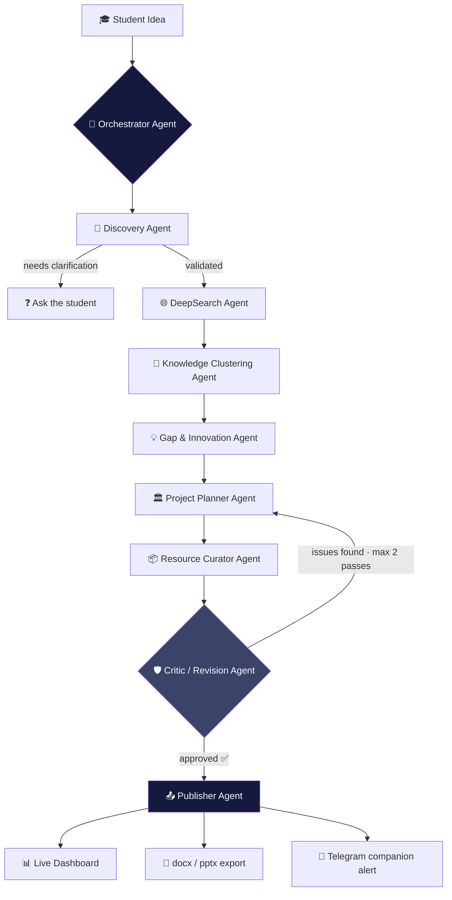
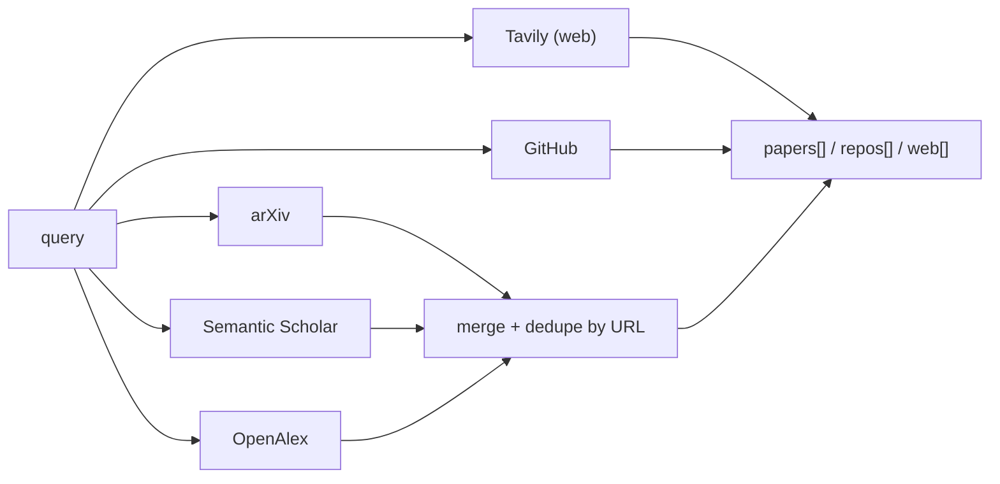

# ⚡ ResearchOS
 
### The multi-agent system that turns a raw idea into a verified, implementation-ready project — before your coffee gets cold.
 
<p>
  
  
  
</p>
> **"Search Less. Solve More."** — ResearchOS doesn't guess. It researches, clusters, critiques, and *proves* its work before you ever see it.
 
---
 
## 🎯 Track
 
**iNSIGHTS Layer 2 — Student Innovation Hackathon**, Team **Novonex**, AISSMS COE, Pune.
 
---
 
## 🧠 The Problem
 
### Who's Affected
Engineering students, hackathon teams, and first-time researchers turning an idea into a working project.
 
### The Core Problem
Every year, students spend hours scattered across Google, YouTube, GitHub, research papers, and forums. Information is outdated, duplicated, and unreliable — making it hard to validate an idea or start building.
 
### Current Solutions
Generic search engines, single-pass AI chatbots, and disconnected tools (Scholar, GitHub search) — none of which connect research to an executable plan.
 
### Key Gaps & Limitations
- No unified path from idea to execution plan
- No citation-backed verification of claims
- No automatic architecture, stack, or roadmap generation
- No detection of research gaps or innovation whitespace
- No continuity — work is lost between sessions
---
 
## 🧬 Our Solution
 
ResearchOS is a scalable, multi-agent research and innovation platform. You give it a raw idea. Nine specialized agents — coordinated by a central orchestrator — go find real papers, real repos, and real web sources, argue with each other about what's actually novel, fact-check every claim against the sources they found, and hand you back an architecture, a roadmap, and an exportable project plan.
 
No single-pass LLM guess. No invented citations. If the evidence isn't there, the system says so instead of making something up.
 
### How It Solves the Problem
- Searches arXiv, Semantic Scholar, OpenAlex, GitHub, and the live web in parallel — not one query at a time
- A Critic Agent verifies every claim against a real retrieved source before anything is shown
- Clusters findings to surface genuine research gaps, not just a summary of what already exists
### Why It's Better
 
| Approach | Limitation | ResearchOS |
|---|---|---|
| Chatbots | One unverified pass, no sources | Multi-source, fact-checked by design |
| Search engines | Links you must filter yourself | Synthesized, structured output |
| Manual research | Hours across scattered tabs | Minutes to a full project plan |
 
---
 
## 🏗️ Architecture
 

 
**DeepSearch fans out in parallel**, not sequentially:
 

 
---
 
## ✨ Key Features
 
| Feature | Description |
|---|---|
| **Parallel DeepSearch** | Queries arXiv, Semantic Scholar, OpenAlex, GitHub, and the live web simultaneously — not one source at a time |
|
**Critic / Revision Loop** | Every claim is checked against a real retrieved source before publishing — built-in fact-checking, not a single guess |
| **Knowledge Clustering** | Automatically groups findings into themes to surface genuine research gaps and innovation angles |
| **Project Hub + AI Companion** | One-click docx/pptx export of the full plan, with a Telegram agent for reminders and progress tracking |
 
---
 
## 🚫 The Zero-Hallucination Policy
 
This isn't a slogan — it's enforced in code, not just prompted for:
 
| Guardrail | Where it lives |
|---|---|
| Every agent's system prompt explicitly forbids inventing sources | All agent prompts |
| Gap & Innovation Agent must cite real `evidence_ids` for every claim | `gapInnovationAgent.js` |
| **Mechanical post-hoc verification** — any cited `evidence_id` that doesn't exist in the real retrieved source list gets stripped automatically, with a console warning | `stripUnverifiedEvidence()` |
| If retrieved evidence is too thin to responsibly claim a gap, the agent says `insufficient_evidence: true` instead of filling space | `gapInnovationAgent.js` |
| Critic Agent re-checks the *entire* assembled plan against original sources before publishing, capped at 2 revision passes | `criticAgent.js` *(upcoming)* |
| Test fixtures never contain fabricated data — sources that can't be reached live are left as honest empty arrays, never mocked | `fixtures/` |
 
---
 
## 🧠 The Agent Roster
 
| # | Agent | Job | Depends on |
|---|---|---|---|
| 1 | **Discovery Agent** | Validates the idea is specific enough to research; asks one clarifying question if not | — |
| 2 | **DeepSearch Agent** | Parallel retrieval across arXiv, Semantic Scholar, OpenAlex, Tavily, GitHub | Discovery |
| 3 | **Gap & Innovation Agent** | Finds genuine, source-grounded research gaps and innovation angles | DeepSearch |
| 4 | **Project Planner Agent** | Turns a chosen angle into architecture, stack, and milestones | Gap & Innovation |
| 5 | **Resource Curator Agent** | Attaches real datasets/repos/APIs — never invented URLs | Planner |
| 6 | **Knowledge Clustering Agent** | Embeds + clusters sources into themes | DeepSearch |
| 7 | **Critic / Revision Agent** | Verifies every claim against real sources, triggers a revision loop | Full draft |
| 8 | **Publisher Agent** | Renders dashboard JSON, docx, pptx, sends Telegram alert | Critic (approved) |
| 9 | **Orchestrator Agent** | Routes the whole pipeline, manages the revision loop, handles failures | All of the above |
 
### Build status (updated as we go — no agent is marked done until it's actually tested against real data)
 
- [x] **Discovery Agent** — built, syntax-verified. Live Gemini call not yet run (needs a real `GEMINI_API_KEY` + network outside the dev sandbox).
- [x] **DeepSearch Agent** — built and **live-tested**: GitHub search confirmed against real API results; arXiv XML parser confirmed against a real sample response. Semantic Scholar / OpenAlex / Tavily are syntax-verified, pending a live run on a machine with full internet access.
- [x] **Gap & Innovation Agent** — built. `stripUnverifiedEvidence()` guardrail **unit-tested and passing** (correctly strips a deliberately fabricated citation while keeping the real one). Full live run (real DeepSearch → real Gemini) pending your machine.
- [ ] Project Planner Agent
- [ ] Resource Curator Agent
- [ ] Knowledge Clustering Agent
- [ ] Critic / Revision Agent
- [ ] Publisher Agent
- [ ] Orchestrator (ADK) — built last, on purpose: every individual agent should be proven before the highest-hallucination-risk piece gets wired in
---
 
## 🛠️ Tech Stack
 
| Layer | Tool |
|---|---|
| LLM reasoning | Gemini 2.5 Flash (`@google/genai`) |
| Orchestration | Google ADK |
| Academic retrieval | arXiv API · Semantic Scholar API · OpenAlex API |
| Web retrieval | Tavily API |
| Code retrieval | GitHub REST API |
| Embeddings + clustering | Gemini `text-embedding-004` · ChromaDB · scikit-learn |
| Workspace persistence | MongoDB |
| Messaging agent | Telegram Bot API |
| Document export | `docx` npm
package · PptxGenJS |
| Frontend | React · Tailwind · Framer Motion · lucide-react (Vite) |
| Backend | Node.js (ES modules) |
 
---
 
## 📁 Project Structure
 
```text
ResearchOS/
├── server/
│   ├── agents/
│   │   ├── discoveryAgent.js           # Idea validation & clarification
│   │   ├── clusteringAgent.js          # Knowledge clustering
│   │   ├── gapInnovationAgent.js       # Research gap detection
│   │   ├── projectPlannerAgent.js      # Architecture & roadmap generation
│   │   ├── resourceCuratorAgent.js     # Datasets, APIs & repositories
│   │   ├── criticAgent.js              # Evidence verification & revision
│   │   ├── publisherAgent.js           # DOCX/PPTX generation
│   │   ├── gapInnovationAgent.test.js
│   │   └── rankAngles.test.js
│   │
│   ├── services/
│   │   ├── deepSearch.js               # Parallel retrieval pipeline
│   │   └── relevanceFilter.js          # Semantic relevance filtering
│   │
│   ├── db/
│   │   ├── mongo.js                    # MongoDB connection
│   │   ├── projectStore.js             # Project persistence
│   │   ├── testConnection.js
│   │   ├── testProjectRecord.js
│   │   └── testGridFS.js
│   │
│   ├── lib/
│   │   └── geminiClient.js             # Shared Gemini client
│   │
│   ├── fixtures/
│   │   └── gapInnovation-foodwaste.json
│   │
│   ├── orchestrator.js                 # Multi-agent workflow controller
│   ├── orchestrator.test.js
│   ├── server.js
│   ├── run.js
│   ├── index.js
│   ├── package.json
│   └── package-lock.json
│
├── src/
│   ├── components/
│   │   ├── IdeaInputScreen.tsx
│   │   ├── AgentProgressScreen.tsx
│   │   ├── MultiAngleProgressScreen.tsx
│   │   ├── AngleSelectionScreen.tsx
│   │   ├── CompareResultsScreen.tsx
│   │   ├── TerminalPage.tsx
│   │   ├── NeedsClarificationCard.tsx
│   │   ├── InsufficientEvidenceCard.tsx
│   │   ├── LeftRail.tsx
│   │   │
│   │   └── ResultsDashboard/
│   │       ├── ResultsDashboard.tsx
│   │       ├── TabOverview.tsx
│   │       ├── TabResearch.tsx
│   │       ├── TabGapsInnovation.tsx
│   │       ├── TabRoadmap.tsx
│   │       └── TabResources.tsx
│   │
│   ├── utils/
│   │   ├── mapper.ts
│   │   └── sse.ts
│   │
│   ├── App.tsx
│   ├── main.tsx
│   ├── index.css
│   ├── mockData.ts
│   └── types.ts
│
├── output-demo-student.docx            # Sample generated report
├── output-demo-student.pptx            # Sample generated presentation
├── index.html
├── package.json
├── tsconfig.json
├── vite.config.ts
├── README.md
└── .gitignore
```
 
---
 
## 🔑 The Data Contract
 
Every agent reads from and writes to this shape. Locking it early is what lets agents be built and tested independently instead of blocking on each other.
 
```json
{
  "studentId": "string",
  "idea_raw": "string",
  "normalized_problem": "string",
  "sources": {
    "papers": [{ "id": "", "title": "", "url": "", "snippet": "", "source": "" }],
    "repos": [{ "id": "", "name": "", "url": "", "stars": 0, "description": "" }],
    "web": [{ "id": "", "title": "", "url": "", "snippet": "" }]
  },
  "clusters": [{ "theme": "", "item_ids": [] }],
  "gaps": [""],
  "innovation_angles": [{ "angle": "", "why_novel": "", "evidence_ids": [] }],
  "plan": {
    "architecture": "",
    "tech_stack": [],
    "milestones": [{ "name": "", "description": "", "duration_days": 0 }]
  },
  "resources": { "datasets": [], "repos": [], "apis": [] },
  "critic": { "approved": false, "issues": [] }
}
```
 
---
 
## 🚀 Getting Started
 
### Prerequisites
- Node.js 18+
- Free API keys (see below)
### Setup
```bash
# 1. Clone
git clone https://github.com/YOUR_USERNAME/researchos.git
cd researchos
 
# 2. Backend
cd server
npm install
cp .env.example .env   # then fill in your keys — see below
 
# 3. Frontend
cd ..
npm install
```
 
### Free API keys you'll need
 
| Service | Get it here | Key required? |
|---|---|---|
| Gemini | https://aistudio.google.com/apikey | Yes |
| Tavily | https://app.tavily.com | Yes |
| GitHub | https://github.com/settings/tokens | Optional (higher rate limit with one) |
| Semantic Scholar |
https://www.semanticscholar.org/product/api | Optional |
| Telegram Bot | Message **@BotFather** on Telegram | Yes, instant |
 
arXiv and OpenAlex need no key at all.
 
### Run the app
```bash
# Terminal 1: Backend
cd server && npm run dev
 
# Terminal 2: Frontend
npm run dev
```
 
### Run an agent's test
```bash
node agents/discoveryAgent.test.js
node services/deepSearch.test.js
node agents/gapInnovationAgent.test.js "your idea here"
```
 
Every agent ships with its own standalone test — run it, read the console output, confirm it before moving to the next agent. That's the whole build philosophy of this repo.
 
---
 
## ☁️ Deployment
 
```
Frontend → Vercel
Backend  → Render
```
 
Stateless agent architecture — add languages or sources without redesign. Runs entirely on free-tier APIs, deployable on free hosting at campus scale.
 
---
 
## 🧪 Testing Philosophy
 
1. **No agent is "done" until it's run against real data at least once** — not a fixture, not a mock, the actual API.
2. **Fixtures are allowed for speed, mocks are not.** A fixture is a saved *real* response. A mock is invented. This repo uses the former, never the latter — if a source can't be reached, the fixture says so honestly with an empty array, not a fabricated entry.
3. **Every guardrail gets a deliberately-broken test case** before it gets trusted — e.g. `stripUnverifiedEvidence` was tested by feeding it a fake citation on purpose to confirm it actually catches hallucination, not just that it runs without crashing.
---
 
## 📊 Impact & Feasibility
 
| Metric | Value |
|---|---|
| Idea to full project plan | <120 sec *(estimated)* |
| Verified sources per query | 5+ |
| Infrastructure cost | $0 — free-tier APIs only |
 
### Feasibility Check
- No paid infrastructure required to run at hackathon or campus scale
- Every retrieval API used has a documented free tier
- Deployable on free hosting (Vercel + Render, or even AWS) within a day
---
 
## 📝 Assumptions
 
1. **Evidence-grounded, not lab-verified** — findings are checked against retrieved sources, not independently peer-reviewed.
2. **Internet required** — all retrieval and AI features require network connectivity to call external APIs.
3. **Free-tier limits** — the application is designed to work within free API rate limits.
4. **Single-project focus per session** — the MVP is designed for one idea-to-plan flow at a time; multi-user collaboration is out of scope.
---
 
## 🔒 Security
 
- API keys stored in environment variables, never committed (`server/.env`)
- Fixtures and test data never contain fabricated or invented sources
- Input validation on all agent entry points
- Rate limiting on retrieval and AI endpoints
---
 
## 🗺️ Roadmap
 
- [ ] Finish agents 4–9
- [ ] Wire the Orchestrator (ADK) — last, deliberately
- [ ] Connect `src/components/ResultsDashboard` to the real backend (currently mock-data-driven for UI development speed)
- [ ] Multilingual input layer (NLLB-200 / IndicTrans2)
- [ ] Deploy: frontend → Vercel, backend → Render
---
 
## 🏆 Built for iNSIGHTS Layer 2 — Student Innovation Hackathon
 
```bash
logicLoops@ResearchOS LogicLoops\Novonex\Team> ls -a
.           RiteshDeshmukh(RDX)        PrathameshHake(Prats)                 .claude
            .antigravity      .codex
```
